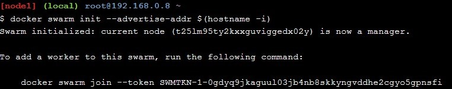
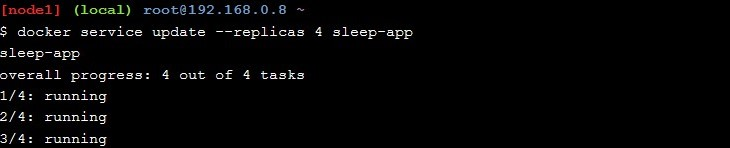

<h1> Materi-04 Docker Orchestration Hands-on Lab </h1>

1. Membuat container baru yang dijalankan pada node 1, perintah berikut berguna untuk membuat container baru yang akan tetap berjalan pada background image docker saat sleep.
 

2. Melakukan cek apakah container tersebut sudah berjalan.
 

3. Membuat Swarm baru, dan join dengan single node lalu melakukan verifikasi jika operasi berhasil.

4. Melakukan join swarm untuk node 2 dan node 3 dengan menggunakan token yang didapat dari pembuaatan swarm sebelumnya.

5. Setelah melakukan join node2 dan node3, kemudian kembali ke node1, dan jalankan perintah docker node ls untuk memastikan bahwa kedua node tersebut sudah join ke Swarm.

6. Dari node 1 akan melakukan deploy sleep pada docker swarm. Deploy merupakan layanan dari docker swarm.

7.  Mereplika pada container sleep-app , ini berguna untuk mendeskripsikan container pada layanan service.

8. Mereplika layanan kembali menjadi hanya 4 container(melakukan pembaruan layanan docker container).

9. Mengecek status node yang berjalan pada node 1.

10. Melihat container yang berjalan pada node 2.

11. Kembali ke node 1 untuk mengambil node 2 dari layanan service. node 2 akan digunakan untuk melakukan drain dimana akan menggantikan node kita dengan node 2.

12. kembali ke node 2, dan jalankan perintah docker ps. hasilnya container pada node 2 sudah tidak berjalan lagi.

13. Kemudian menghapus layanan service pada node 1.

14. Kemudian menjalankan perintah docker ps pada node 1 untuk melihat daftar container yang sedang berjalan.

15. Kemudian menghapus semua swarm container untuk node 1, node 2 dan node 3.
