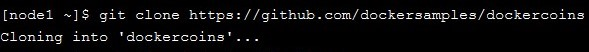
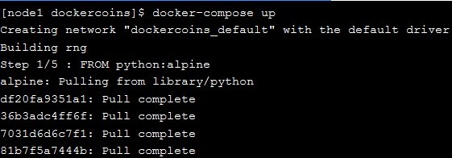
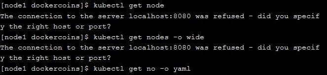
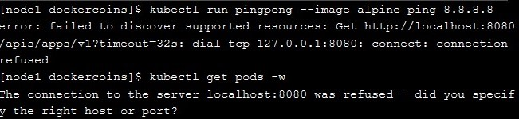
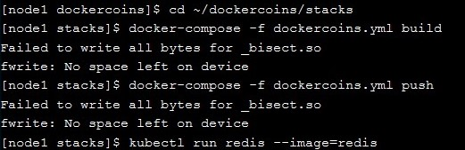
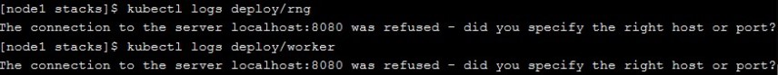
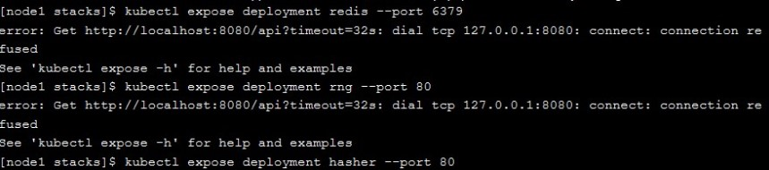
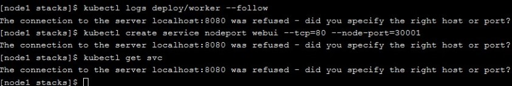
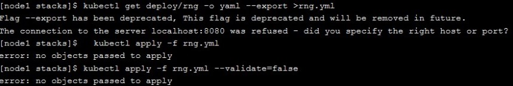

<h1> Materi-06 Kubernetes For Beginners </h1>

1. Melakukan clonning repo dari git dockercoins.
 

2. Selanjutnya masuk pada direktori dockercoins dan kemudian menjalankan perintah docker-compose up, untuk menjalankan semua container yang ada pada dockercoins.
 

3. Melihat cluster kita. apakah semuanya sudah terkoneksi pada server yang sama atau tidak.

4. Melakukan ping pada server image docker alpine pada 0.0.0.0 .

5. Masuk ke direktori stacks, kemudian membuka file dockercoins.yml lalu melakukan push.

6. Melihat hasil deploy pada rng dan worker

7.  Melihat hasil deploy pada port server redis 6379, pada server rng di port 80 dan server hasher di port 80

8. Melihat logs deploy worker, melakukan cek service node port pada tcp 80 dan port 30001 serta menampilkan svc

9. Melakukan export rng menjadi file yml dan menampilkannya

10. Melakukan running rng ,melihat describe rng dan selanjutnya melakukan update rng serta menjalankannya.
 

